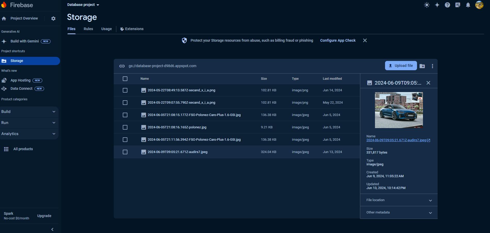

# Contributors:

- Helena Szczepanowska
- Tomasz Kurcoń

# Project name: Car rental

# Used technologies:

- MongoDB, Mongoose
- Node.js with Express.js,
- Postman
- Firebase Storage

# API Documentation

https://documenter.getpostman.com/view/34873190/2sA3XJjQ83#30f48e74-74fd-4d8e-8eb0-c3356289866c

# Project Documentation PL

Projekt „Car Rental” automatyzuje proces wynajmu samochodów, umożliwiając klientom łatwe przeglądanie dostępnych modeli według różnych kryteriów oraz dokonywanie rezerwacji na konkretny termin. Dodatkowo system pozwala na wystawianie opinii widocznych dla innych użytkowników.

Do realizacji projektu wykorzystana została technologia Mongoose, będąca ODM (Object Data Modeling) dla MongoDB, która oferuje prostą, opartą na schematach metodę modelowania danych aplikacji, w której każdy stworzony schemat jest mapowany do kolekcji i definiuje strukturę jej dokumentów, zapewniając walidację danych.

## Funkcje systemu

### Administrator

- Dodawanie samochodów do oferty
- Edycja oferty samochodowej
- Usuwanie samochodów z oferty
- Usuwanie opinii
- Edycja wynajmów
- Usuwanie wynajmów
- Podgląd wynajmów bieżących oraz z danego okresu

Raporty:

- Raport przychodu z danego okresu
- Raport rocznego przychodu z podziałem na miesiące
- Raport rocznego przychodu z podziałem na samochody

### Użytkownik

- Wynajem samochodu
- Edycja daty wynajmu samochodu, jeżeli jeszcze nie jest opłacony
- Płatność za wynajem (zmiana statusu płatności)
- Anulowanie wynajmu
- Podgląd historii wynajmów
- Dodawanie opinii

Sortowania:

- Według najlepiej ocenianych samochodów
- Według najczęściej wybieranych samochodów
- Według najdroższych/najtańszych samochodów

Filtry:

- Po przedziale cenowy
- Po dostępności w danym terminie
- Po specyfikacji pojazdu (marka, rok produkcji, kolor, rodzaj paliwa)

## Kolekcje i przykładowe dokumenty

Poniżej przedstawione zostały opisy dokumentów w każdej z kolecji oraz ich przykłady.

### Users

Pola:

- email
- hasło
- rola

Dokumenty zagnieżdżone:

- wynajmy (data rozpoczęcia, zakończenia)

Każdy user przechowuje podstawowe informacje o swoich wynajmach w celu łatwego dostępu do historii wynajmów użytkownika.

```json
{
  "_id": { "$oid": "66619c234fa556751d70daad" },
  "email": "admin@test.pl",
  "password": "$2a$12$FNaI1agBCQSjEoA74LwPV.t5aBAzKliPGgQUob8XQ2OtPTQa9h9tC",
  "roles": ["admin", "user"],
  "rentals": [
    {
      "rentalId": { "$oid": "666be7678cd60b1e1e713086" },
      "startDate": { "$date": { "$numberLong": "1731283200000" } },
      "endDate": { "$date": { "$numberLong": "1731715200000" } },
      "_id": { "$oid": "666be7678cd60b1e1e713088" }
    }
  ]
}
```

### Cars

Pola:

- marka
- model
- cena za dzień wynajmu
- rocznik
- kolor
- typ paliwa
- ilość
- zdjęcia

Dokumenty zagnieżdżone:

- wynajmy
- opinie

Każdy samochód przechowuje daty swoich wynajmów. Jest to szczególnie istotne przy wypożyczaniu samochodu, ponieważ dzięki temu w szybki sposób sprawdzamy czy auto w danym terminie jest dostępne. Dodatkowo przechowuje swoje opinie co jest przydatne przy filtrowaniu samochodów według średniej oceny oraz wyświetlaniu ich na stronie.

```json
{
  "_id": { "$oid": "666570528f5eed94a75aa3a6" },
  "brand": "Audi",
  "model": "RS7",
  "pricePerDay": { "$numberInt": "3000" },
  "year": { "$numberInt": "2023" },
  "color": "blue",
  "fuelType": "gasoline",
  "quantity": { "$numberInt": "3" },
  "images": ["2024-06-09T09:05:21.671Z-audirs7.jpeg"],
  "rentals": [
    {
      "rentalId": { "$oid": "666be7678cd60b1e1e713086" },
      "startDate": { "$date": { "$numberLong": "1731283200000" } },
      "endDate": { "$date": { "$numberLong": "1731715200000" } },
      "_id": { "$oid": "666be7678cd60b1e1e713088" }
    }
  ],
  "reviews": [
      {
      "reviewId": { "$oid": "665da27a450fae1ad78e8474" },
      "user": { "$oid": "66532b027995bdde6e23768f" },
      "rating": { "$numberInt": "4" },
      "description": "Very nice car!",
      "_id": { "$oid": "665da27a450fae1ad78e8476" }
    }
  ],
  "createdAt": { "$date": { "$numberLong": "1717923922367" } },
  "updatedAt": { "$date": { "$numberLong": "1718347623404" } }
}
```

---

### Rentals

Pola:
- id użytkownika wynajmującego
- id wynajmowanego samochodu
- data rozpoczęcia wynajmu
- data zakończenia wynajmu
- całkowity koszt wynajmu
- status płatności

```json
{
  "_id": { "$oid": "666be7678cd60b1e1e713086" },
  "user": { "$oid": "66532b027995bdde6e23768f" },
  "car": { "$oid": "666570528f5eed94a75aa3a6" },
  "startDate": { "$date": { "$numberLong": "1731283200000" } },
  "endDate": { "$date": { "$numberLong": "1731715200000" } },
  "price": { "$numberInt": "18000" },
  "paid": false,
  "createdAt": { "$date": { "$numberLong": "1718347623358" } },
  "updatedAt": { "$date": { "$numberLong": "1718347623358" } }
}
```
---

### Reviews

Pola:

- id użytkownika, który wystawił opinie
- id samochodu, którego dotyczy opinia
- treść opinii
- ocena (1-5)

```json
{
  "_id": { "$oid": "665b76341ca600a0e90c98bc" },
  "car": { "$oid": "665b28f35b8ea7d1954b0a96" },
  "user": { "$oid": "66532b027995bdde6e23768f" },
  "description": "Very fast car, but uncomfortable!",
  "rating": { "$numberInt": "4" },
  "createdAt": { "$date": { "$numberLong": "1717270068385" } },
  "updatedAt": { "$date": { "$numberLong": "1717270068385" } }
}
```

## Schematy i modele

Aby móc skorzystać ze schematów, musimy stworzyć z nich modele. Instancja modelu jest dokumentem. Modele odpowiedzialne są za tworzenie i odczytywanie dokumentów z bazy danych MongoDB. Tworząc model, podajemy schemat oraz nazwę kolekcji, która będzie przez niego reprezentowana.

Schematy umożliwiają:

- ustawianie typów pól dokumentu:

```js
type: String;
```

- ustawianie wymaganych pól:

```js
required: true;
```

- wstawianie domyślnych wartości pól:

```js
default:[]
```

- ustawianie pola jako enuma

```js
enum: ["admin", "user"];
```

- ustawianie różnych właściwości pola, np typów Number zakresu wartości

```js
type: Number,
min: 1,
max: 5,
```

- oznaczanie pola jako referencji do innej kolekcji

```js
rentalId: {
    type: Schema.Types.ObjectId,
    ref: "Rental"
}
```

- automatyczne wstawianie do dokumentu timestampów

```js
timestamps: true;
```

```json
{
  "createdAt": "2024-06-02T11:58:57.343+00:00",
  "updatedAt": "2024-06-09T08:46:12.552+00:00"
}
```

To tylko niektóre z opcji oferowanych przez Mongoose. Przedstawione zostały tylko te używane przez nas w projekcie.

## Schematy stworzone w projekcie:

```js
const mongoose = require("mongoose");
const Schema = mongoose.Schema;
```

### userSchema

```js
const Roles = {
  ADMIN: "admin",
  USER: "user",
};
```

```js
const userSchema = new Schema({
  email: {
    required: true,
    type: String,
  },
  password: {
    required: true,
    type: String,
  },
  roles: {
    type: [String],
    enum: [Roles.ADMIN, Roles.USER],
    default: [Roles.USER],
  },
  rentals: {
    type: [
      {
        rentalId: {
          type: Schema.Types.ObjectId,
          ref: "Rental",
          required: true,
        },
        startDate: {
          type: Date,
          required: true,
        },
        endDate: {
          type: Date,
          required: true,
        },
        price: {
          type: Number,
          required: true,
        },
      },
    ],
    default: [],
  },
});

module.exports = mongoose.model("User", userSchema);
```

### carSchema

```js
const carSchema = new Schema(
  {
    brand: {
      type: String,
      required: true,
    },
    model: {
      type: String,
      required: true,
    },
    pricePerDay: {
      type: Number,
      required: true,
    },
    year: {
      type: Number,
      required: true,
    },
    color: {
      type: String,
      required: true,
    },
    fuelType: {
      type: String,
      required: true,
    },
    quantity: {
      type: Number,
      minimum: 1,
      required: true,
    },
    images: {
      type: [String],
      required: true,
      default: [],
    },
    rentals: {
      type: [
        {
          rentalId: {
            type: Schema.Types.ObjectId,
            ref: "Rental",
            required: true,
          },
          startDate: {
            type: Date,
            required: true,
          },
          endDate: {
            type: Date,
            required: true,
          },
        },
      ],
      default: [],
    },
    reviews: {
      type: [
        {
          reviewId: {
            type: Schema.Types.ObjectId,
            ref: "Review",
            required: true,
          },
          user: {
            type: Schema.Types.ObjectId,
            ref: "User",
            required: true,
          },
          rating: {
            type: Number,
            required: true,
          },
          description: {
            type: String,
            required: true,
          },
        },
      ],
      default: [],
    },
  },
  {
    timestamps: true,
  }
);

module.exports = mongoose.model("Car", carSchema);
```

### rentalSchema

```js
const rentalSchema = new Schema(
  {
    user: {
      type: Schema.Types.ObjectId,
      ref: "User",
    },
    car: {
      type: Schema.Types.ObjectId,
      ref: "Car",
    },
    startDate: {
      type: Date,
      required: true,
    },
    endDate: {
      type: Date,
      required: true,
    },
    price: {
      type: Number,
      required: true,
    },
    paid: {
      type: Boolean,
      default: false,
    },
  },
  {
    timestamps: true,
  }
);

module.exports = mongoose.model("Rental", rentalSchema);
```

### reviewSchema

```js
const reviewSchema = new Schema(
  {
    car: {
      type: Schema.Types.ObjectId,
      ref: "Car",
    },
    user: {
      type: Schema.Types.ObjectId,
      ref: "User",
      required: true,
    },
    description: {
      type: String,
      required: true,
    },
    rating: {
      type: Number,
      min: 1,
      max: 5,
      required: true,
    },
  },
  {
    timestamps: true,
  }
);

module.exports = mongoose.model("Review", reviewSchema);
```

---

Pole `_id` jest automatycznie dodawane do tworzonych schematów.

## Autentykacja i autoryzacja

W naszym systemie możemy wyróżnić 3 różne role:
- `admin`,
- `user`,
- `guest`.

Do procesu uwierzytelniania użyliśmy JWT Tokens. 

W przypadku ścieżek `admina` i `usera`, do wysyłanego requesta potrzebujemy dołączyć nagłówek `Authorization` wraz z JWT tokenem, otrzymanym podczas logowania.

Informacja o rolach, które posiada dany użytkownik jest zapisywana w bazie danych.
```json
"roles":["admin","user"]
```
Autentykacja odbywa się przy pomocy middleware `requireAuth`. Wyciągamy w nim token z Authorization header, następnie sprawdzamy jego ważność i wyciągamy `_id` zapisanego w nim usera. Następnie wyciągamy z bazy danych tego użytkownika przy pomocy modelu `User` i dodajemy go do obiektu `req`.
```js
const jwt = require("jsonwebtoken");
const User = require("../models/user");
const requireAuth = async (req, res, next) => {
  const { authorization } = req.headers;
  if (!authorization) {
    return res.status(401).send({ error: "Authorization token required" });
  }
  const token = authorization.split(" ")[1];

  try {
    const { _id } = jwt.verify(token, process.env.TOKEN_SECRET);
    req.user = await User.findById(_id);
    next();
  } catch (error) {
    console.log(error);
    res.status(401).send({ error: "Request is not authenticated" });
  }
};
```
Natomiast autoryzacja jest realizowana za pomocą `authorizeRole`. Sprawdza ona role wyciągniętego wcześniej z bazy danych użytkownika i jeśli posiada on wymaganą rolę, to request jest przepuszczany dalej.
```js
const authorizeRole = (roles) => {
    return (req, res, next) => {
      if (!req.user || !req.user.roles || !req.user.roles.some(role => roles.includes(role))) {
        return res.status(403).json({ message: "Forbidden" });
      }
      next();
    };
  }
```

## Operacje CRUD oraz operacje o charakterze transakcyjnym

### Dodawanie samochodu do oferty

`/admin/car/add`

```js
exports.postAddCar = async (req, res) => {
  const {
    brand,
    model,
    pricePerDay,
    year,
    color,
    fuelType,
    quantity,
    rentals,
    ratings,
  } = req.body;
  const images = [];
  try {
    const files = req.files;
    for (const file of files) {
      const fileName = await uploadFile(file);
      images.push(fileName);
    }
  } catch (error) {
    console.log(error);
    res.status(500).json({ error: "Internal server error" });
  }
  const car = new Car({
    brand,
    model,
    pricePerDay,
    year,
    color,
    fuelType,
    quantity,
    rentals,
    ratings,
    images
  });
  try {
    await car.save();
    res.status(201).json({ message: "Car added successfully" });
  } catch (error) {
    console.log(error);
    res.status(500).json({ error: "Internal server error" });
  }
};
```

### Wynajem samochodu

`/user/rental/add`

Przy każdej próbie wynajmu samochodu sprawdzana jest dostępna ilość tego modelu w podanym terminie i tylko wtedy, gdy jest przynajmniej jeden dostępny samochód wynajem przebiega pomyślnie. Dodatkowo niektóre dane wynajmu dodawane są również do kolekcji `Users` oraz `Cars`.

```js
exports.postAddRental = async (req, res) => {
  const { car, startDate, endDate, user, paid } = req.body;
  const session = await mongoose.startSession();
  session.startTransaction();
  try {

    const start = new Date(startDate);
    const end = new Date(endDate);

    const carDetails = await Car.findById(car).session(session);
    if (!carDetails) {
      await session.abortTransaction();
      session.endSession();
      return res.status(404).json({
        message: "Car not found"
      });
    }

    const userDetails = await User.findById(user).session(session);
    if (!userDetails) {
      await session.abortTransaction();
      session.endSession();
      return res.status(404).json({
        message: "User not found"
      });
    }

    if(start >= end){
      await session.abortTransaction();
      session.endSession();
      return res.status(400).json({
        message: "End date should be greater than start date."
      });
    }
    
    const overlappingRentals = carDetails.rentals.filter((rental) => {
      return start <= rental.endDate && end >= rental.startDate;
    });

    if (overlappingRentals.length >= carDetails.quantity) {
      await session.abortTransaction();
      session.endSession();
      return res.status(400).json({
        message: "Car is already rented for the requested dates."
      });
    }

    const pricePerDay = carDetails.pricePerDay;
    const diffTime = Math.abs(end - start);
    const diffDays = Math.ceil(diffTime / (1000 * 60 * 60 * 24)) + 1; 
    const price = diffDays * pricePerDay;
    const rental = new Rental({
      car, 
      user, 
      startDate, 
      endDate, 
      price, 
      paid
    });
    await rental.save({ session });

    carDetails.rentals.push({
      rentalId: rental._id,
      startDate,
      endDate
    });
    await carDetails.save({ session });
    userDetails.rentals.push({
      rentalId: rental._id,
      startDate,
      endDate,
      price
    });
    await userDetails.save({ session });
    await session.commitTransaction();
    session.endSession();
    res.status(201).json({ message: "Rental added successfully" });
  } catch (error) {
    console.error(error);
    await session.abortTransaction();
    session.endSession();
    res.status(500).json({ error: "Internal server error" });
  }
};
```

### Dodawanie opinii

`/user/review/add`

```js
exports.postAddReview = async (req, res) => {
    const { car, user, description, rating } = req.body;
    const session = await mongoose.startSession();
  
    try {
      await session.withTransaction(async () => {
        const carDetails = await Car.findById(car).session(session);
        if (!carDetails) {
          throw { statusCode: 404, message: "Car not found" };
        }
  
        const review = new Review({
          car,
          user,
          description,
          rating
        });
        await review.save({ session });
  
        carDetails.reviews.push({
          reviewId: review._id,
          user,
          description,
          rating
        });
        await carDetails.save({ session });
  
        res.status(201).json({ message: "Review added successfully" });
      });
    } catch (error) {
      console.error(error);
  
      const statusCode = error.statusCode || 500;
      const errorMessage = error.message || "Internal server error";
  
      res.status(statusCode).json({ error: errorMessage });
    } finally {
      session.endSession();
    }
  };
```

### Zmiana daty wynajmu

`/user/rental/update`

Użytkownik może zmienić datę swojego wynajmu tylko wtedy, gdy nie jest jeszcze opłacony oraz gdy wynajmowany samochód jest dostępny w nowo wybranym terminie.

```js
exports.patchUpdateRentalDates = async (req, res) => {
  const { rentalId, newStartDate, newEndDate } = req.body;
  const session = await mongoose.startSession();
  try {
    await session.withTransaction(async () => {
      const rentalDetails = await Rental.findById(rentalId).session(session);
    
      if (!rentalDetails) {
        throw { statusCode: 404, message: "Rental not found" };
      }

      const carDetails = await Car.findById(rentalDetails.car._id).session(session);
      if (!carDetails) {
        throw { statusCode: 404, message: "Car not found" };
      }

      const userDetails = await User.findById(rentalDetails.user).session(session);

      const start = new Date(newStartDate);
      const end = new Date(newEndDate);
      
      if (rentalDetails.paid === true) {
        throw { statusCode: 400, message: "Cannot update dates for a paid rental." };
      }

      if (start >= end) {
        throw { statusCode: 400, message: "End date should be greater than start date." };
      }

      const overlappingRentals = carDetails.rentals.filter((rental) => {
        return start <= rental.endDate && end >= rental.startDate && rental.rentalId.toString() !== rentalId;
      });

      if (overlappingRentals.length >= carDetails.quantity) {
        throw { statusCode: 400, message: "Car is already rented for the requested dates." };
      }

      const pricePerDay = carDetails.pricePerDay;
      const diffTime = Math.abs(end - start);
      const diffDays = Math.ceil(diffTime / (1000 * 60 * 60 * 24)) + 1; 
      const newPrice = diffDays * pricePerDay;

      rentalDetails.startDate = start;
      rentalDetails.endDate = end;
      rentalDetails.price = newPrice;
      await rentalDetails.save({ session });

      carDetails.rentals = carDetails.rentals.filter(rental => rental.rentalId.toString() !== rentalDetails._id.toString());
      carDetails.rentals.push({
        rentalId,
        startDate: start,
        endDate: end
      });
      await carDetails.save({ session });

      userDetails.rentals = userDetails.rentals.filter(rental => rental.rentalId.toString() !== rentalDetails._id.toString());
      userDetails.rentals.push({
        rentalId,
        startDate: start,
        endDate: end,
        price: newPrice
      });
      await userDetails.save({ session });

      res.status(200).json({
        message: "Rental updated successfully",
        newStartDate: start,
        newEndDate: end,
        newPrice
      });
    });
  } catch (error) {
    console.error(error);

    const statusCode = error.statusCode || 500;
    const errorMessage = error.message || "Internal server error";

    res.status(statusCode).json({ error: errorMessage });
  } finally {
    session.endSession();
  }
};
```

### Zmiana statusu płatności

`/user/rental/pay`

```js
exports.patchUpdateRentalPaidStatus = async (req, res) => {
  const { rentalId } = req.body;

  try {
      const rental = await Rental.findById(rentalId);

      if (!rental) {
          return res.status(404).json({ message: "Rental not found" });
      }

      rental.paid = true;
      await rental.save();
      
      res.status(200).json({
          message: "Rental paid status updated successfully"
      });
  } catch (error) {
      console.error(error);
      res.status(500).json({ message: "Internal server error" });
  }
};
```

### Anulowanie wynajmu

`/user/rental/delete/{rentalId}`

```js
exports.deleteRemoveRental = async (req, res) => {
  const rentalId = req.params.id;
  const session = await mongoose.startSession();

  try {
    await session.withTransaction(async () => {
      const rentalDetails = await Rental.findById(rentalId).session(session);
      if (!rentalDetails) {
        throw { statusCode: 404, message: "Rental not found" };
      }

      const carDetails = await Car.findById(rentalDetails.car).session(session);
      if (!carDetails) {
        throw { statusCode: 404, message: "Car not found" };
      }

      const userDetails = await User.findById(rentalDetails.user).session(session);
      
      carDetails.rentals = carDetails.rentals.filter(rental => rental.rentalId.toString() !== rentalId);
      await carDetails.save({ session });

      userDetails.rentals = userDetails.rentals.filter(rental => rental.rentalId.toString() !== rentalId);
      await userDetails.save({ session });
      await Rental.deleteOne({ _id: rentalId }).session(session);

      res.status(200).json({ message: "Rental removed successfully" });
    });
  } catch (error) {
    console.error(error);

    const statusCode = error.statusCode || 500;
    const errorMessage = error.message || "Internal server error";

    res.status(statusCode).json({ error: errorMessage });
  } finally {
    session.endSession();
  }
};
```

### Wyświetlenie historii wynajmów użytkownika

`/user/rental/history/{userId}`

```js
exports.getUserRentalHistory = async (req, res) => {

  const params = req.params; 
  const userId = params.id;

  try {
    const user = await User.findById(userId);

    if (!user) {
      return res.status(404).json({
        message: "User not found"
      });
    }
    res.status(200).json({
      userId,
      rentalHistory: user.rentals
    });
  } catch (error) {
    console.error(error);
    res.status(500).json({
      error: "Internal server error"
    });
  }
};
```

## Raporty

### Raport rocznego przychodu z podziałem na miesiące

`/admin/rental/yearly-income?year={year}`

```js
exports.getYearlyIncomeReport = async (req, res) => {
    const { year } = req.query;

    if (!year) {
        return res.status(400).json({ message: "Year is required in query parameters." });
    }

    const yearStart = new Date(`${year}-01-01`);
    const yearEnd = new Date(`${year}-12-31`);

    try {
        const result = await Rental.aggregate([
            {
                $match: {
                    startDate: { $gte: yearStart },
                    endDate: { $lte: yearEnd }
                }
            },
            {
                $group: {
                    _id: { 
                        month: { $month: "$startDate" } 
                    },
                    totalIncome: { $sum: "$price" }
                }
            },
            {
                $sort: {
                    "_id.month": 1
                }
            }
        ]);

        if (result.length === 0) {
            return res.status(404).json({ message: "No income found for the given year." });
        }

        const monthlyIncome = result.map(item => ({
            month: item._id.month,
            income: item.totalIncome
        }));

        const response = {
            reportTitle: `Yearly Income for ${year}`,
            data: monthlyIncome
        };

        res.status(200).json(response);
    } catch (error) {
        console.error(error);
        res.status(500).json({ error: "Internal server error" });
    }
};
```

### Raport rocznego przychodu z podziałem na samochody

`/admin/rental/car-income?year={year}`

```js
exports.getYearlyIncomePerCarReport = async (req, res) => {
    const { year } = req.query;

    if (!year) {
        return res.status(400).json({ message: "Year is required in query parameters." });
    }

    const yearStart = new Date(`${year}-01-01`);
    const yearEnd = new Date(`${year}-12-31`);

    try {
        const result = await Rental.aggregate([
            {
                $match: {
                    startDate: { $gte: yearStart },
                    endDate: { $lte: yearEnd }
                }
            },
            {
                $group: {
                    _id: "$car",
                    totalIncome: { $sum: "$price" }
                }
            },
            {
                $lookup: {
                    from: "cars",
                    localField: "_id",
                    foreignField: "_id",
                    as: "carDetails"
                }
            },
            {
                $unwind: "$carDetails"
            },
            {
                $project: {
                    _id: 0,
                    brand: "$carDetails.brand",
                    model: "$carDetails.model",
                    year: "$carDetails.year",
                    totalIncome: 1
                }
            },
            {
                $sort: {
                    totalIncome: -1
                }
            }
        ]);

        if (result.length === 0) {
            return res.status(404).json({ message: "No income found for the given year." });
        }

        const response = {
            reportTitle: `Yearly Income Per Car for ${year}`,
            data: result
        };

        res.status(200).json(response);
    } catch (error) {
        console.error(error);
        res.status(500).json({ error: "Internal server error" });
    }
};
```

## Sortowanie i filtrowanie samochodów

### Sortowanie według średniej ocen

`/guest/car/top-rated`

```js
exports.getTopRatedCars = async (req, res) => {
  try {
    const cars = await Car.aggregate([
      {
        $addFields: {
          reviewCount: { $size: "$reviews" }
        }
      },
      {
        $unwind: {
          path: "$reviews",
          preserveNullAndEmptyArrays: true
        }
      },
      {
        $group: {
          _id: "$_id", 
          avgRating: { $avg: "$reviews.rating" }, 
          numOfRatings: { $first: "$reviewCount" }, 
          brand: { $first: "$brand" },
          model: { $first: "$model" },
          pricePerDay: { $first: "$pricePerDay" },
          year: { $first: "$year" },
          color: { $first: "$color" },
          fuelType: { $first: "$fuelType" },
          quantity: { $first: "$quantity" },
          images: { $first: "$images" }
        }
      },
      {
        $sort: {
          avgRating: -1,
          numOfRatings: -1
        }
      }
    ]);

    if (cars.length === 0) {
      return res.status(404).json({ message: "No cars found" });
    }
    console.log(cars)
    await transformCarImagesToUrl(cars);
    res.status(200).json(cars);
  } catch (error) {
    console.error(error);
    res.status(500).json({ error: "Internal server error" });
  }
};
```

## Filtrowanie według parametrów samochodu

`guest/car/filter?brand={brand}&priceMin={priceMin}&priceMax={priceMax}&startDate={startDate}&endDate={endDate}&yearMin{yearMin}&yearMax={yearMax}&color={color}&fuelType={fuelType}`

```js
exports.getFilteredCars = async (req, res) => {
  const { brand, priceMin, priceMax, startDate, endDate, yearMin, yearMax, color, fuelType } = req.query;

  try {
      const filter = {};
      if (brand) {
          const brands = brand.split(','); 
          filter.brand = { $in: brands }; 
      }
      if (color) {
        const colors = color.split(','); 
        filter.color = { $in: colors }; 
      }
      if (fuelType) {
          const fuelTypes = fuelType.split(','); 
          filter.fuelType = { $in: fuelTypes }; 
      }
      if (priceMin || priceMax) {
          filter.pricePerDay = {};
          if (priceMin) {
              filter.pricePerDay.$gte = Number(priceMin);
          }
          if (priceMax) {
              filter.pricePerDay.$lte = Number(priceMax);
          }
      }
      if (yearMin || yearMax) {
          filter.year = {};
          if (yearMin) {
              filter.year.$gte = Number(yearMin);
          }
          if (yearMax) {
              filter.year.$lte = Number(yearMax);
          }
      }
    
      const overlapping = {};
      if (startDate && endDate) {
          overlapping.rentals = {
              $filter: {
                  input: "$rentals",
                  as: "rental",
                  cond: {
                      $and: [
                          { $lte: ["$$rental.startDate", new Date(endDate)] },
                          { $gte: ["$$rental.endDate", new Date(startDate)] }
                      ]
                  }
              }
          };
      }

      const cars = await Car.aggregate([
          { $match: filter },
          {
              $addFields: {
                  overlappingRentals: overlapping.rentals ? overlapping.rentals : []
              }
          },
          {
              $addFields: {
                  numberOfRented: { $size: "$overlappingRentals" }
              }
          },
          {
              $match: {
                  $expr: {
                      $lt: ["$numberOfRented", "$quantity"]
                  }
              }
          },
          { $project: { brand: 1, model: 1, pricePerDay: 1, year: 1, color: 1, fuelType: 1, quantity: 1, numberOfRented: 1, images:1 } }
      ]);

      if (cars.length === 0) {
          return res.status(404).json({ message: "No cars found that match the filters." });
      }
      await transformCarImagesToUrl(cars);
      res.status(200).json(cars);
  } catch (error) {
      console.error(error);
      res.status(500).json({ error: "Internal server error" });
  }
};
```

## Połączenie z serwisem Firebase

W projekcie wykorzystaliśmy Firebase Storage w którym przechowywujemy pliki (zdjęcia samochodów). W bazie danych zapisujemy natomiast tylko nazwy plików.


Z Firebase łączymy się za pomocą Firebase Admin SDK, podając odpowiednie `credentials` oraz nazwę storage'a.
```js
const serviceAccountConfig = {
  type: process.env.FIREBASE_TYPE,
  project_id: process.env.FIREBASE_PROJECT_ID,
  private_key_id: process.env.FIREBASE_PRIVATE_KEY_ID,
  private_key: process.env.FIREBASE_PRIVATE_KEY,
  client_email: process.env.FIREBASE_CLIENT_EMAIL,
  client_id: process.env.FIREBASE_CLIENT_ID,
  auth_uri: process.env.FIREBASE_AUTH_URI,
  token_uri: process.env.FIREBASE_TOKEN_URI,
  auth_provider_x509_cert_url: process.env.FIREBASE_AUTH_PROVIDER_X509_CERT_URL,
  client_x509_cert_url: process.env.FIREBASE_CLIENT_X509_CERT_URL
}

const app = admin.initializeApp(
  {
    credential: admin.credential.cert(serviceAccountConfig),
    storageBucket: process.env.FIREBASE_STORAGE_BUCKET
  }
);

const storage = admin.storage(app);

module.exports = storage;
```
Stworzone zostały odpowiednie funkcje pozwalające na dodawanie, usuwanie i wyciąganie plików z storage'a.

```js
const storage = require("../config/firebase.config");
const { getDownloadURL } = require("firebase-admin/storage");
```

```js
exports.getFileURL = async (fileName) => {
  try {
    const fileRef = storage.bucket().file(fileName);
    const downloadURL = await getDownloadURL(fileRef);
    return downloadURL;
  } catch (error) {
    throw new Error(error);
  }
};
```

```js
exports.uploadFile = async (file) => {
  try {
    const fileName = new Date().toISOString() + "-" + file.originalname;
    const data = file.buffer;
    const fileRef = storage.bucket().file(fileName);
    await fileRef.save(data);
    return fileName;
  } catch (error) {
    throw new Error(error);
  }
};
```

```js
exports.deleteFile = async (fileName) => {
  try {
    const fileRef = storage.bucket().file(fileName);
    await fileRef.delete();
  } catch (error) {
    throw new Error(error);
  }
};
```

Teraz dodając samochód do bazy danych, pierwsze musimy dodać wszystkie zdjęcia do storage.

```js
for (const file of files) {
  const fileName = await uploadFile(file);
  images.push(fileName);
}
```

```js
const car = new Car({
  brand,
  model,
  pricePerDay,
  year,
  color,
  fuelType,
  quantity,
  rentals,
  ratings,
  images,
});
await car.save();
```

Przy wyciąganiu aut z bazy danych, zamieniamy nazwy zdjęć na URL do plików w storage'u, korzystając z utworzonej pomocniczej funkcji `transformCarImagesToUrl`

```js
const transformCarImagesToUrl = async (cars) => {
  await Promise.all(
    cars.map(async (car) => {
      car.images = await Promise.all(
        car.images.map((image) => getFileURL(image))
      );
    })
  );
};
```

```js
const cars = await Car.find();
await transformCarImagesToUrl(cars);
res.status(200).json(cars);
```
