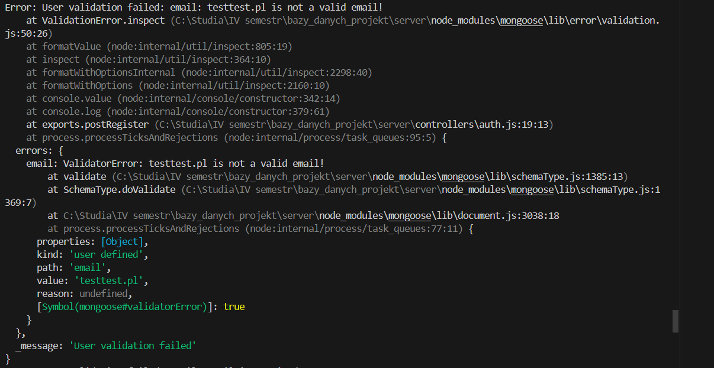
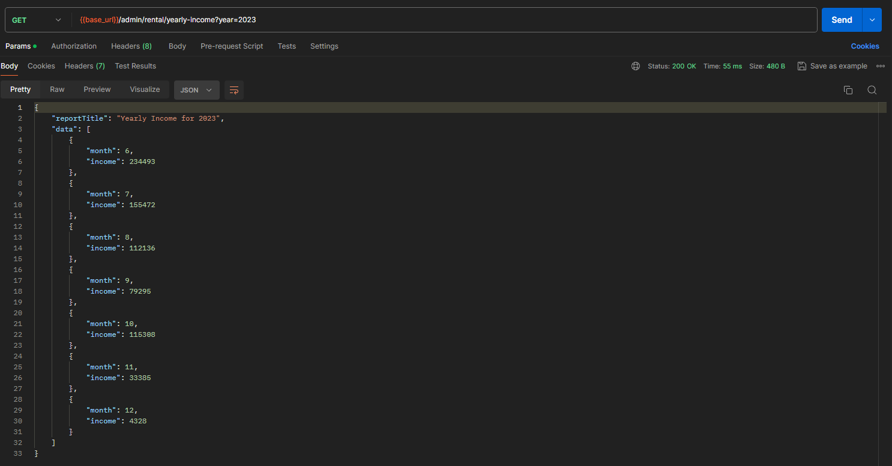
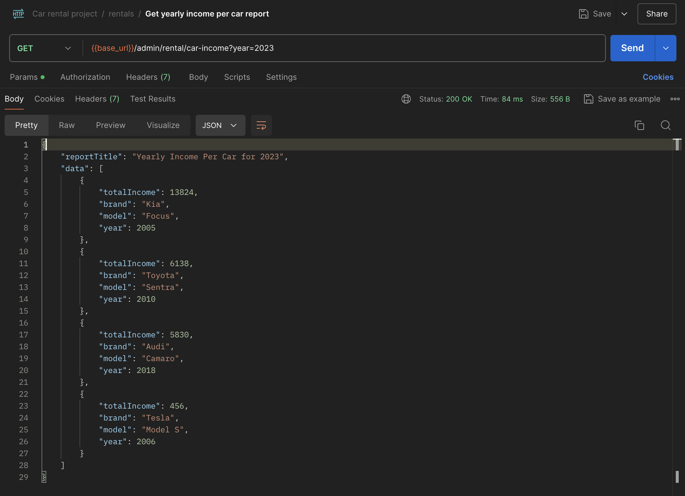
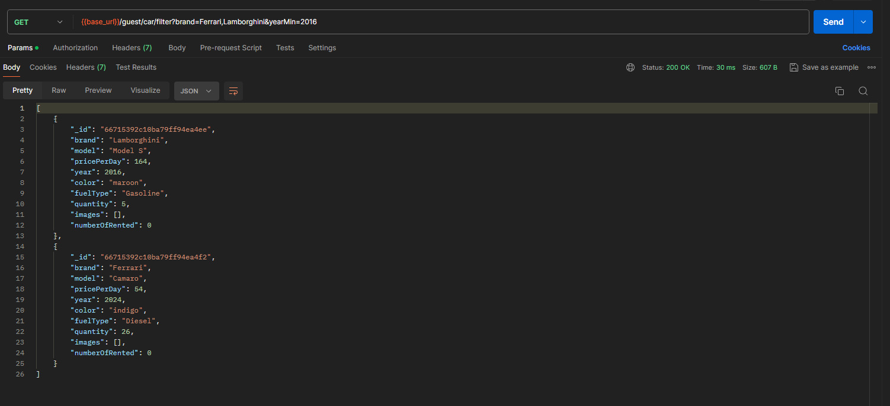

# Autorzy:

- Helena Szczepanowska
- Tomasz Kurcoń

# Nazwa projektu: Wypożyczalnia samochodów 🚗

# Technologie 🚀:

- MongoDB, Mongoose,
- Node.js with Express.js,
- Postman,
- Firebase,
- faker.

# Dokumentacja API 📃
https://documenter.getpostman.com/view/34873190/2sA3XJjQ83#30f48e74-74fd-4d8e-8eb0-c3356289866c

Powyższy link prowadzi do dokumentacji na hostingu Postmana. Widoczne tam są wszystkie stworzone endpointy, wraz z krótkimi opisami oraz przykładowymi requestami zapisanymi w formacie cURL.
# Dokumentacja projektu 📖

Projekt „Wypożyczalnia samochodów” automatyzuje proces wynajmu samochodów, umożliwiając klientom łatwe przeglądanie dostępnych modeli według różnych kryteriów oraz dokonywanie rezerwacji na konkretny termin. Dodatkowo system pozwala na wystawianie opinii widocznych dla innych użytkowników.

Do realizacji projektu wykorzystana została technologia Mongoose, będąca ODM (Object Data Modeling) dla MongoDB, która oferuje prostą, opartą na schematach metodę modelowania danych aplikacji, w której każdy stworzony schemat jest mapowany do kolekcji i definiuje strukturę jej dokumentów, zapewniając walidację danych.

## Funkcje systemu

### Administrator

- Dodawanie samochodów do oferty
- Edycja oferty samochodowej
- Usuwanie samochodów z oferty
- Usuwanie opinii
- Edycja wynajmów
- Usuwanie wynajmów
- Podgląd wynajmów bieżących oraz z danego okresu

Raporty:

- Raport przychodu z danego okresu
- Raport rocznego przychodu z podziałem na miesiące
- Raport rocznego przychodu z podziałem na samochody

### Użytkownik

- Wynajem samochodu
- Edycja daty wynajmu samochodu, jeżeli jeszcze nie jest opłacony
- Płatność za wynajem (zmiana statusu płatności)
- Anulowanie wynajmu
- Podgląd historii wynajmów
- Dodawanie opinii

Sortowania:

- Według najlepiej ocenianych samochodów
- Według najczęściej wybieranych samochodów
- Według najdroższych/najtańszych samochodów

Filtry:

- Po przedziale cenowy
- Po dostępności w danym terminie
- Po specyfikacji pojazdu (marka, rok produkcji, kolor, rodzaj paliwa)

## Kolekcje i przykładowe dokumenty

Poniżej przedstawione zostały opisy dokumentów w każdej z kolekcji oraz ich przykłady.

### Users

Pola:

- email
- hasło
- rola

Dokumenty zagnieżdżone:

- wynajmy (data rozpoczęcia, zakończenia)

Każdy user przechowuje podstawowe informacje o swoich wynajmach w celu łatwego dostępu do historii wynajmów użytkownika.

```json
{
  "_id": { "$oid": "66619c234fa556751d70daad" },
  "email": "admin@test.pl",
  "password": "$2a$12$FNaI1agBCQSjEoA74LwPV.t5aBAzKliPGgQUob8XQ2OtPTQa9h9tC",
  "roles": ["admin", "user"],
  "rentals": [
    {
      "rentalId": { "$oid": "666be7678cd60b1e1e713086" },
      "startDate": { "$date": "2024-06-18T09:29:54.454+00:00" },
      "endDate": { "$date": "2024-06-19T09:29:54.454+00:00" },
      "_id": { "$oid": "666be7678cd60b1e1e713088" }
    }
  ]
}
```

### Cars

Pola:

- marka
- model
- cena za dzień wynajmu
- rocznik
- kolor
- typ paliwa
- ilość
- zdjęcia

Dokumenty zagnieżdżone:

- wynajmy
- opinie

Każdy samochód przechowuje daty swoich wynajmów. Jest to szczególnie istotne przy wypożyczaniu samochodu, ponieważ dzięki temu w szybki sposób sprawdzamy czy auto w danym terminie jest dostępne. Dodatkowo przechowuje swoje opinie co jest przydatne przy filtrowaniu samochodów według średniej oceny oraz wyświetlaniu ich na stronie.

```json
{
  "_id": { "$oid": "666570528f5eed94a75aa3a6" },
  "brand": "Audi",
  "model": "RS7",
  "pricePerDay": { "$numberInt": "3000" },
  "year": { "$numberInt": "2023" },
  "color": "blue",
  "fuelType": "gasoline",
  "quantity": { "$numberInt": "3" },
  "images": ["2024-06-09T09:05:21.671Z-audirs7.jpeg"],
  "rentals": [
    {
      "rentalId": { "$oid": "666be7678cd60b1e1e713086" },
      "startDate": { "$date": "2024-06-18T09:29:54.454+00:00" },
      "endDate": { "$date": "2024-06-19T09:29:54.454+00:00" },
      "_id": { "$oid": "666be7678cd60b1e1e713088" }
    }
  ],
  "reviews": [
      {
      "reviewId": { "$oid": "665da27a450fae1ad78e8474" },
      "user": { "$oid": "66532b027995bdde6e23768f" },
      "rating": { "$numberInt": "4" },
      "description": "Very nice car!",
      "_id": { "$oid": "665da27a450fae1ad78e8476" }
    }
  ],
  "createdAt": { "$date": { "$numberLong": "1717923922367" } },
  "updatedAt": { "$date": { "$numberLong": "1718347623404" } }
}
```

---

### Rentals

Pola:
- id użytkownika wynajmującego
- id wynajmowanego samochodu
- data rozpoczęcia wynajmu
- data zakończenia wynajmu
- całkowity koszt wynajmu
- status płatności

```json
{
  "_id": { "$oid": "666be7678cd60b1e1e713086" },
  "user": { "$oid": "66532b027995bdde6e23768f" },
  "car": { "$oid": "666570528f5eed94a75aa3a6" },
  "startDate": { "$date": "2024-06-18T09:29:54.454+00:00" },
  "endDate": { "$date": "2024-06-20T09:29:54.454+00:00" },
  "price": { "$numberInt": "18000" },
  "paid": false,
  "createdAt": { "$date": "2024-06-18T09:29:54.454+00:00" },
  "updatedAt": { "$date": "2024-06-18T09:29:54.454+00:00" }
}
```
---

### Reviews

Pola:

- id użytkownika, który wystawił opinie
- id samochodu, którego dotyczy opinia
- treść opinii
- ocena (1-5)

```json
{
  "_id": { "$oid": "665b76341ca600a0e90c98bc" },
  "car": { "$oid": "665b28f35b8ea7d1954b0a96" },
  "user": { "$oid": "66532b027995bdde6e23768f" },
  "description": "Very fast car, but uncomfortable!",
  "rating": { "$numberInt": "4" },
  "createdAt": { "$date": "2024-06-18T09:29:54.454+00:00" },
  "updatedAt": { "$date": "2024-06-18T09:29:54.454+00:00" }
}
```

## Schematy i modele

Aby móc skorzystać ze schematów, musimy stworzyć z nich modele. Instancja modelu jest dokumentem. Modele odpowiedzialne są za tworzenie i odczytywanie dokumentów z bazy danych MongoDB. Tworząc model, podajemy schemat oraz nazwę kolekcji, która będzie przez niego reprezentowana.

Schematy umożliwiają:

- ustawianie typów pól dokumentu:

```js
type: String;
```
- wprowadzanie bardziej skomplikowanej walidacji, na przykład sprawdzanie poprawności e-maila przy użyciu Regexpa: 
```js
 validate: {
      validator: function (v) {
        return /^([\w-.]+@([\w-]+\.)+[\w-]{2,4})?$/.test(v);
      },
      message: (props) => `${props.value} is not a valid email!`,
    },
  }
```

- ustawianie wymaganych pól:

```js
required: true;
```
Możemy również ustawić treść błędu, jeżeli coś z schematu nie zostanie spełnione:
```js
required: [true, "Email is required"],
```

- wstawianie domyślnych wartości pól:

```js
default:[]
```

- ustawianie pola jako enuma

```js
enum: ["admin", "user"];
```

- ustawianie różnych właściwości pola, np typów Number zakresu wartości

```js
type: Number,
min: 1,
max: 5,
```

- oznaczanie pola jako referencji do innej kolekcji

```js
rentalId: {
    type: Schema.Types.ObjectId,
    ref: "Rental"
}
```

- automatyczne wstawianie do dokumentu timestampów

```js
timestamps: true;
```

```json
{
  "createdAt": "2024-06-02T11:58:57.343+00:00",
  "updatedAt": "2024-06-09T08:46:12.552+00:00"
}
```

To tylko niektóre z opcji oferowanych przez Mongoose. Przedstawione zostały tylko te używane przez nas w projekcie.

## Schematy stworzone w projekcie:

```js
const mongoose = require("mongoose");
const Schema = mongoose.Schema;
```

### userSchema

```js
const Roles = {
  ADMIN: "admin",
  USER: "user",
};
```

```js
const mongoose = require("mongoose");
const Roles = require("../utils/roles");
const Schema = mongoose.Schema;
const userSchema = new Schema({
  email: {
    required: [true, "Email is required"],
    unique: true,
    type: String,
    validate: {
      validator: function (v) {
        return /^([\w-.]+@([\w-]+\.)+[\w-]{2,4})?$/.test(v);
      },
      message: (props) => `${props.value} is not a valid email!`,
    },
  },
  password: {
    required: true,
    type: String,
  },
  roles: {
    type: [String],
    enum: [Roles.ADMIN, Roles.USER],
    default: [Roles.USER]
  },
  rentals:  { 
    type: [
      {
        rentalId: {
          type: Schema.Types.ObjectId,
          ref: "Rental",
          required: true
        },
        startDate: {
          type: Date,
          required: true
        },
        endDate: {
          type: Date,
          required: true
        },
        price: {
          type: Number,
          required: true
        },
      }
  ], 
  default: []
  }
});

module.exports = mongoose.model("User", userSchema);
```

### carSchema

```js
const carSchema = new Schema(
  {
    brand: {
      type: String,
      required: true,
    },
    model: {
      type: String,
      required: true,
    },
    pricePerDay: {
      type: Number,
      required: true,
    },
    year: {
      type: Number,
      required: true,
    },
    color: {
      type: String,
      required: true,
    },
    fuelType: {
      type: String,
      required: true,
    },
    quantity: {
      type: Number,
      minimum: 1,
      required: true,
    },
    images: {
      type: [String],
      required: true,
      default: [],
    },
    rentals: {
      type: [
        {
          rentalId: {
            type: Schema.Types.ObjectId,
            ref: "Rental",
            required: true,
          },
          startDate: {
            type: Date,
            required: true,
          },
          endDate: {
            type: Date,
            required: true,
          },
        },
      ],
      default: [],
    },
    reviews: {
      type: [
        {
          reviewId: {
            type: Schema.Types.ObjectId,
            ref: "Review",
            required: true,
          },
          user: {
            type: Schema.Types.ObjectId,
            ref: "User",
            required: true,
          },
          rating: {
            type: Number,
            required: true,
          },
          description: {
            type: String,
            required: true,
          },
        },
      ],
      default: [],
    },
  },
  {
    timestamps: true,
  }
);

module.exports = mongoose.model("Car", carSchema);
```

### rentalSchema

```js
const rentalSchema = new Schema(
  {
    user: {
      type: Schema.Types.ObjectId,
      ref: "User",
    },
    car: {
      type: Schema.Types.ObjectId,
      ref: "Car",
    },
    startDate: {
      type: Date,
      required: true,
    },
    endDate: {
      type: Date,
      required: true,
    },
    price: {
      type: Number,
      required: true,
    },
    paid: {
      type: Boolean,
      default: false,
    },
  },
  {
    timestamps: true,
  }
);

module.exports = mongoose.model("Rental", rentalSchema);
```

### reviewSchema

```js
const reviewSchema = new Schema(
  {
    car: {
      type: Schema.Types.ObjectId,
      ref: "Car",
    },
    user: {
      type: Schema.Types.ObjectId,
      ref: "User",
      required: true,
    },
    description: {
      type: String,
      required: true,
    },
    rating: {
      type: Number,
      min: 1,
      max: 5,
      required: true,
    },
  },
  {
    timestamps: true,
  }
);

module.exports = mongoose.model("Review", reviewSchema);
```

---

Pole `_id` jest automatycznie dodawane do tworzonych schematów.


## Walidacja danych na podstawie schematów

Mongoose dokona walidacji danych za każdym razem, kiedy będziemy dodawać lub zmieniać dokument. Jeżeli dane nie będą zgodne z schematem, to otrzymamy błąd, a operacja na bazie danych się nie wykona. Dzięki temu możemy zapewnić sobie, że dane przechowywane w bazie będą sensowne. Poniżej wykonana została próba dodania użytkownika z niepoprawnym adresem e-mail.
<br></br>

## Autentykacja i autoryzacja

W naszym systemie możemy wyróżnić 3 różne role:
- `admin`,
- `user`,
- `guest`.

Do procesu uwierzytelniania użyliśmy JWT Tokens. 

W przypadku ścieżek `admina` i `usera`, do wysyłanego requesta potrzebujemy dołączyć nagłówek `Authorization` wraz z JWT tokenem, otrzymanym podczas logowania.

Informacja o rolach, które posiada dany użytkownik jest zapisywana w bazie danych.
```json
"roles":["admin","user"]
```
Autentykacja odbywa się przy pomocy middleware `requireAuth`. Wyciągamy w nim token z Authorization header, następnie sprawdzamy jego ważność i wyciągamy `_id` zapisanego w nim usera. Następnie wyciągamy z bazy danych tego użytkownika przy pomocy modelu `User` i dodajemy go do obiektu `req`.
```js
const jwt = require("jsonwebtoken");
const User = require("../models/user");
const requireAuth = async (req, res, next) => {
  const { authorization } = req.headers;
  if (!authorization) {
    return res.status(401).send({ error: "Authorization token required" });
  }
  const token = authorization.split(" ")[1];

  try {
    const { _id } = jwt.verify(token, process.env.TOKEN_SECRET);
    req.user = await User.findById(_id);
    next();
  } catch (error) {
    console.log(error);
    res.status(401).send({ error: "Request is not authenticated" });
  }
};
```
Natomiast autoryzacja jest realizowana za pomocą `authorizeRole`. Sprawdza ona role wyciągniętego wcześniej z bazy danych użytkownika i jeśli posiada on wymaganą rolę, to request jest przepuszczany dalej.
```js
const authorizeRole = (roles) => {
    return (req, res, next) => {
      if (!req.user || !req.user.roles || !req.user.roles.some(role => roles.includes(role))) {
        return res.status(403).json({ message: "Forbidden" });
      }
      next();
    };
  }
```

## Operacje CRUD oraz operacje o charakterze transakcyjnym

### Dodawanie samochodu do oferty

`/admin/car/add`
Aby dodać nowy samochód, tworzymy instancję naszego modelu `car` podając odpowiednie dane. Aby następnie dodać dokument do bazy danych, wystarczy wywołać asynchroniczną metodę, którą implementuje Mongoose: `car.save()`.
```js
exports.postAddCar = async (req, res) => {
  const {
    brand,
    model,
    pricePerDay,
    year,
    color,
    fuelType,
    quantity,
    rentals,
    ratings,
  } = req.body;
  const images = [];
  try {
    const files = req.files;
    for (const file of files) {
      const fileName = await uploadFile(file);
      images.push(fileName);
    }
  } catch (error) {
    console.log(error);
    res.status(500).json({ error: "Internal server error" });
  }
  const car = new Car({
    brand,
    model,
    pricePerDay,
    year,
    color,
    fuelType,
    quantity,
    rentals,
    ratings,
    images
  });
  try {
    await car.save();
    res.status(201).json({ message: "Car added successfully" });
  } catch (error) {
    console.log(error);
    res.status(500).json({ error: "Internal server error" });
  }
};
``` 
### Wynajem samochodu

`/user/rental/add`

Przy każdej próbie wynajmu samochodu sprawdzana jest dostępna ilość tego modelu w podanym terminie i tylko wtedy, gdy jest przynajmniej jeden dostępny samochód wynajem przebiega pomyślnie. Dodatkowo niektóre dane wynajmu dodawane są również do kolekcji `Users` oraz `Cars`.
Operacja dodawania wynajmu ma charakter transakcyjny. Aby rozpocząć transakcje korzystając z Mongoose, dodaliśmy następujący fragment kodu:
```js
const session = await mongoose.startSession();
session.startTransaction();
```
Następnie przy wykonywaniu każdej operacji na bazie danych, podawaliśmy utworzoną sesję:
```js
Car.findById(car).session(session);
```
lub
```js
await rental.save({ session });
```
Jeżeli któraś z operacji się nie powiodła to przerywaliśmy transakcje i cofane zostały wszystkie pozostałe:
```js
await session.abortTransaction();
session.endSession();
```
Jeżeli natomiast wszystkie operacje się powiodły, to zatwierdzaliśmy transakcje i zmiany dokonywały się w bazie:
```js
await session.commitTransaction();
session.endSession();
```
```js
exports.postAddRental = async (req, res) => {
  const { car, startDate, endDate, user, paid } = req.body;
  const session = await mongoose.startSession();
  session.startTransaction();
  try {

    const start = new Date(startDate);
    const end = new Date(endDate);

    const carDetails = await Car.findById(car).session(session);
    if (!carDetails) {
      await session.abortTransaction();
      session.endSession();
      return res.status(404).json({
        message: "Car not found"
      });
    }

    const userDetails = await User.findById(user).session(session);
    if (!userDetails) {
      await session.abortTransaction();
      session.endSession();
      return res.status(404).json({
        message: "User not found"
      });
    }

    if(start >= end){
      await session.abortTransaction();
      session.endSession();
      return res.status(400).json({
        message: "End date should be greater than start date."
      });
    }
    
    const overlappingRentals = carDetails.rentals.filter((rental) => {
      return start <= rental.endDate && end >= rental.startDate;
    });

    if (overlappingRentals.length >= carDetails.quantity) {
      await session.abortTransaction();
      session.endSession();
      return res.status(400).json({
        message: "Car is already rented for the requested dates."
      });
    }

    const pricePerDay = carDetails.pricePerDay;
    const diffTime = Math.abs(end - start);
    const diffDays = Math.ceil(diffTime / (1000 * 60 * 60 * 24)) + 1; 
    const price = diffDays * pricePerDay;
    const rental = new Rental({
      car, 
      user, 
      startDate, 
      endDate, 
      price, 
      paid
    });
    await rental.save({ session });

    carDetails.rentals.push({
      rentalId: rental._id,
      startDate,
      endDate
    });
    await carDetails.save({ session });
    userDetails.rentals.push({
      rentalId: rental._id,
      startDate,
      endDate,
      price
    });
    await userDetails.save({ session });
    await session.commitTransaction();
    session.endSession();
    res.status(201).json({ message: "Rental added successfully" });
  } catch (error) {
    console.error(error);
    await session.abortTransaction();
    session.endSession();
    res.status(500).json({ error: "Internal server error" });
  }
};
```

### Dodawanie opinii

`/user/review/add`
Przy dodawaniu opinii również wykorzystaliśmy transakcje, jednak tym razem w inny sposób. Ponownie stworzyliśmy nową sesję i na niej wywołaliśmy metodę `withTransaction`:
```js
await session.withTransaction(async ()=>{})
```
Ta metoda upraszcza nam proces wykonywania operacji w ramach transakcji, ponieważ automatycznie zarządza jej cyklem życia. Przekazujemy do niej funkcje, w której wykonujemy operacje na bazie danych. Transakcja jest automatycznie rozpoczynana. Jeżeli funkcja w którymś momencie rzuci błąd, to automatycznie jest odrzucana, a w przeciwnym wypadku - zatwierdzana. Dzięki temu otrzymujemy wygodniejsze i krótsze rozwiązanie.
```js
exports.postAddReview = async (req, res) => {
    const { car, user, description, rating } = req.body;
    const session = await mongoose.startSession();
  
    try {
      await session.withTransaction(async () => {
        const carDetails = await Car.findById(car).session(session);
        if (!carDetails) {
          throw { statusCode: 404, message: "Car not found" };
        }
  
        const review = new Review({
          car,
          user,
          description,
          rating
        });
        await review.save({ session });
  
        carDetails.reviews.push({
          reviewId: review._id,
          user,
          description,
          rating
        });
        await carDetails.save({ session });
  
        res.status(201).json({ message: "Review added successfully" });
      });
    } catch (error) {
      console.error(error);
  
      const statusCode = error.statusCode || 500;
      const errorMessage = error.message || "Internal server error";
  
      res.status(statusCode).json({ error: errorMessage });
    } finally {
      session.endSession();
    }
  };
```

### Zmiana daty wynajmu

`/user/rental/update`

Użytkownik może zmienić datę swojego wynajmu tylko wtedy, gdy nie jest jeszcze opłacony oraz gdy wynajmowany samochód jest dostępny w nowo wybranym terminie.
Dane wyszukiwane są w kolekcji przy użyciu metody `findById` do której podajemy `id` dokumentu, który chcemy otrzymać.
```js
exports.patchUpdateRentalDates = async (req, res) => {
  const { rentalId, newStartDate, newEndDate } = req.body;
  const session = await mongoose.startSession();
  try {
    await session.withTransaction(async () => {
      const rentalDetails = await Rental.findById(rentalId).session(session);
    
      if (!rentalDetails) {
        throw { statusCode: 404, message: "Rental not found" };
      }

      const carDetails = await Car.findById(rentalDetails.car._id).session(session);
      if (!carDetails) {
        throw { statusCode: 404, message: "Car not found" };
      }

      const userDetails = await User.findById(rentalDetails.user).session(session);

      const start = new Date(newStartDate);
      const end = new Date(newEndDate);
      
      if (rentalDetails.paid === true) {
        throw { statusCode: 400, message: "Cannot update dates for a paid rental." };
      }

      if (start >= end) {
        throw { statusCode: 400, message: "End date should be greater than start date." };
      }

      const overlappingRentals = carDetails.rentals.filter((rental) => {
        return start <= rental.endDate && end >= rental.startDate && rental.rentalId.toString() !== rentalId;
      });

      if (overlappingRentals.length >= carDetails.quantity) {
        throw { statusCode: 400, message: "Car is already rented for the requested dates." };
      }

      const pricePerDay = carDetails.pricePerDay;
      const diffTime = Math.abs(end - start);
      const diffDays = Math.ceil(diffTime / (1000 * 60 * 60 * 24)) + 1; 
      const newPrice = diffDays * pricePerDay;

      rentalDetails.startDate = start;
      rentalDetails.endDate = end;
      rentalDetails.price = newPrice;
      await rentalDetails.save({ session });

      carDetails.rentals = carDetails.rentals.filter(rental => rental.rentalId.toString() !== rentalDetails._id.toString());
      carDetails.rentals.push({
        rentalId,
        startDate: start,
        endDate: end
      });
      await carDetails.save({ session });

      userDetails.rentals = userDetails.rentals.filter(rental => rental.rentalId.toString() !== rentalDetails._id.toString());
      userDetails.rentals.push({
        rentalId,
        startDate: start,
        endDate: end,
        price: newPrice
      });
      await userDetails.save({ session });

      res.status(200).json({
        message: "Rental updated successfully",
        newStartDate: start,
        newEndDate: end,
        newPrice
      });
    });
  } catch (error) {
    console.error(error);

    const statusCode = error.statusCode || 500;
    const errorMessage = error.message || "Internal server error";

    res.status(statusCode).json({ error: errorMessage });
  } finally {
    session.endSession();
  }
};
```

### Zmiana statusu płatności

`/user/rental/pay`
Aby zmienić już istniejący dokument, wystarczy wydobyć go z bazy danych, zmienić go jak zwykły obiekt Javascript, a następnie wykonać na nim tą samą metodę jak przy dodawaniu nowego dokumentu, czyli `.save()`.
```js
exports.patchUpdateRentalPaidStatus = async (req, res) => {
  const { rentalId } = req.body;

  try {
      const rental = await Rental.findById(rentalId);

      if (!rental) {
          return res.status(404).json({ message: "Rental not found" });
      }

      rental.paid = true;
      await rental.save();
      
      res.status(200).json({
          message: "Rental paid status updated successfully"
      });
  } catch (error) {
      console.error(error);
      res.status(500).json({ message: "Internal server error" });
  }
};
```

### Anulowanie wynajmu

`/user/rental/delete/{rentalId}`

```js
exports.deleteRemoveRental = async (req, res) => {
  const rentalId = req.params.id;
  const session = await mongoose.startSession();

  try {
    await session.withTransaction(async () => {
      const rentalDetails = await Rental.findById(rentalId).session(session);
      if (!rentalDetails) {
        throw { statusCode: 404, message: "Rental not found" };
      }

      const carDetails = await Car.findById(rentalDetails.car).session(session);
      if (!carDetails) {
        throw { statusCode: 404, message: "Car not found" };
      }

      const userDetails = await User.findById(rentalDetails.user).session(session);
      
      carDetails.rentals = carDetails.rentals.filter(rental => rental.rentalId.toString() !== rentalId);
      await carDetails.save({ session });

      userDetails.rentals = userDetails.rentals.filter(rental => rental.rentalId.toString() !== rentalId);
      await userDetails.save({ session });
      await Rental.deleteOne({ _id: rentalId }).session(session);

      res.status(200).json({ message: "Rental removed successfully" });
    });
  } catch (error) {
    console.error(error);

    const statusCode = error.statusCode || 500;
    const errorMessage = error.message || "Internal server error";

    res.status(statusCode).json({ error: errorMessage });
  } finally {
    session.endSession();
  }
};
```

### Wyświetlenie historii wynajmów użytkownika

`/user/rental/history/{userId}`

```js
exports.getUserRentalHistory = async (req, res) => {

  const params = req.params; 
  const userId = params.id;

  try {
    const user = await User.findById(userId);

    if (!user) {
      return res.status(404).json({
        message: "User not found"
      });
    }
    res.status(200).json({
      userId,
      rentalHistory: user.rentals
    });
  } catch (error) {
    console.error(error);
    res.status(500).json({
      error: "Internal server error"
    });
  }
};
```

## Raporty

### Raport rocznego przychodu z podziałem na miesiące

`/admin/rental/yearly-income?year={year}`
Wykorzystujemy tutaj metodę `aggregate`, która umożliwia nam przetwarzanie wielu dokumentów i zwracanie odpowiednich danych. W tym celu wykorzystane zostały dodatkowo odpowiednie operatory:
- `$match` - filtruje wynajmy według daty rozpoczęcia i zakończenia, pozostawiając tylko te w określonym zakresie,
- `$group` - grupuje wyniki po miesiącu rozpoczęcia wynajmu i sumuje przychody z każdego miesiąca,
- `$sort` - sortuje wyniki według miesiąca, od najwcześniejszego do najpóźniejszego.
```js
exports.getYearlyIncomeReport = async (req, res) => {
    const { year } = req.query;

    if (!year) {
        return res.status(400).json({ message: "Year is required in query parameters." });
    }

    const yearStart = new Date(`${year}-01-01`);
    const yearEnd = new Date(`${year}-12-31`);

    try {
        const result = await Rental.aggregate([
            {
                $match: {
                    startDate: { $gte: yearStart },
                    endDate: { $lte: yearEnd }
                }
            },
            {
                $group: {
                    _id: { 
                        month: { $month: "$startDate" } 
                    },
                    totalIncome: { $sum: "$price" }
                }
            },
            {
                $sort: {
                    "_id.month": 1
                }
            }
        ]);

        if (result.length === 0) {
            return res.status(404).json({ message: "No income found for the given year." });
        }

        const monthlyIncome = result.map(item => ({
            month: item._id.month,
            income: item.totalIncome
        }));

        const response = {
            reportTitle: `Yearly Income for ${year}`,
            data: monthlyIncome
        };

        res.status(200).json(response);
    } catch (error) {
        console.error(error);
        res.status(500).json({ error: "Internal server error" });
    }
};
```

### Raport rocznego przychodu z podziałem na samochody

`/admin/rental/car-income?year={year}`

Aby uzyskać przychód dla każdego samochodu, musimy odwołać się do kolekcji `Rentals` oraz `Cars`.  Wypożyczenie przechowuje `id` samochodu. Aby otrzymać informacje o tym samochodzie, wykorzystujemy operator `$lookup`, który łączy dane z kolekcji `Rentals` z kolekcją `Cars`.

W wyniku `$lookup`, pole carDetails jest tablicą (nawet jeśli zawiera tylko jeden element). Operator `$unwind` przekształca tę tablicę w pojedynczy dokument, co ułatwia dalsze przetwarzanie.

Natomiast operator `$project` umożliwia określenie, które pola mają zostać wybrane do wynikowego dokumentu.
```js
exports.getYearlyIncomePerCarReport = async (req, res) => {
    const { year } = req.query;

    if (!year) {
        return res.status(400).json({ message: "Year is required in query parameters." });
    }

    const yearStart = new Date(`${year}-01-01`);
    const yearEnd = new Date(`${year}-12-31`);

    try {
        const result = await Rental.aggregate([
            {
                $match: {
                    startDate: { $gte: yearStart },
                    endDate: { $lte: yearEnd }
                }
            },
            {
                $group: {
                    _id: "$car",
                    totalIncome: { $sum: "$price" }
                }
            },
            {
                $lookup: {
                    from: "cars",
                    localField: "_id",
                    foreignField: "_id",
                    as: "carDetails"
                }
            },
            {
                $unwind: "$carDetails"
            },
            {
                $project: {
                    _id: 0,
                    brand: "$carDetails.brand",
                    model: "$carDetails.model",
                    year: "$carDetails.year",
                    totalIncome: 1
                }
            },
            {
                $sort: {
                    totalIncome: -1
                }
            }
        ]);

        if (result.length === 0) {
            return res.status(404).json({ message: "No income found for the given year." });
        }

        const response = {
            reportTitle: `Yearly Income Per Car for ${year}`,
            data: result
        };

        res.status(200).json(response);
    } catch (error) {
        console.error(error);
        res.status(500).json({ error: "Internal server error" });
    }
};
```

## Sortowanie i filtrowanie samochodów

### Sortowanie według średniej ocen
`/guest/car/top-rated`

Liczbę ocen samochodu możemy uzyskać sprawdzając długość listy operatorem `$size`. Następnie możemy dodać nowe pole `reviewCount` do zwracanych dokumentów, przy użyciu operatora `$addFields`. Wykorzystane zostały jeszcze inne operatory:
- `$avg` - oblicza średnią wartość pola dla każdej grupy,
- `$first` -  zwraca pierwszy element z grupy dokumentów dla określonego pola,
- `$sort` - umożliwia sortowanie po różnych polach oraz w różnej kolejności.

```js
exports.getTopRatedCars = async (req, res) => {
  try {
    const cars = await Car.aggregate([
      {
        $addFields: {
          reviewCount: { $size: "$reviews" }
        }
      },
      {
        $unwind: {
          path: "$reviews",
          preserveNullAndEmptyArrays: true
        }
      },
      {
        $group: {
          _id: "$_id", 
          avgRating: { $avg: "$reviews.rating" }, 
          numOfRatings: { $first: "$reviewCount" }, 
          brand: { $first: "$brand" },
          model: { $first: "$model" },
          pricePerDay: { $first: "$pricePerDay" },
          year: { $first: "$year" },
          color: { $first: "$color" },
          fuelType: { $first: "$fuelType" },
          quantity: { $first: "$quantity" },
          images: { $first: "$images" }
        }
      },
      {
        $sort: {
          avgRating: -1,
          numOfRatings: -1
        }
      }
    ]);

    if (cars.length === 0) {
      return res.status(404).json({ message: "No cars found" });
    }
    console.log(cars)
    await transformCarImagesToUrl(cars);
    res.status(200).json(cars);
  } catch (error) {
    console.error(error);
    res.status(500).json({ error: "Internal server error" });
  }
};
```

## Filtrowanie według parametrów samochodu

`guest/car/filter?brand={brand}&priceMin={priceMin}&priceMax={priceMax}&startDate={startDate}&endDate={endDate}&yearMin{yearMin}&yearMax={yearMax}&color={color}&fuelType={fuelType}`

Wykorzystane operatory:
- `$in` - sprawdza, czy wartość pola znajduje się w określonej tablicy wartości. W tym przypadku używany do filtrowania samochodów na podstawie marki, koloru i rodzaju paliwa,
- `$lte` - operator porównania, który sprawdza, czy wartość pola jest mniejsza lub równa określonej wartości. Wykorzystywany do filtrowania samochodów na podstawie maksymalnej ceny za dzień i maksymalnego roku produkcji,
- `$gte` - operator porównania, który sprawdza, czy wartość pola jest większa lub równa określonej wartości. Wykorzystywany do filtrowania samochodów na podstawie minimalnej ceny za dzień i minimalnego roku produkcji,
- `$filter` - operator używany do filtrowania elementów tablicy na podstawie warunku. W tym przypadku, używany do filtrowania wynajmów samochodów, które nakładają się z określonym zakresem dat,
- `$and` -  operator logiczny, który zwraca prawdę, jeśli wszystkie wyrażenia w tablicy są prawdziwe. Używany w kontekście $filter do sprawdzenia, czy wynajem samochodu mieści się w określonym zakresie dat.
```js
exports.getFilteredCars = async (req, res) => {
  const { brand, priceMin, priceMax, startDate, endDate, yearMin, yearMax, color, fuelType } = req.query;

  try {
      const filter = {};
      if (brand) {
          const brands = brand.split(','); 
          filter.brand = { $in: brands }; 
      }
      if (color) {
        const colors = color.split(','); 
        filter.color = { $in: colors }; 
      }
      if (fuelType) {
          const fuelTypes = fuelType.split(','); 
          filter.fuelType = { $in: fuelTypes }; 
      }
      if (priceMin || priceMax) {
          filter.pricePerDay = {};
          if (priceMin) {
              filter.pricePerDay.$gte = Number(priceMin);
          }
          if (priceMax) {
              filter.pricePerDay.$lte = Number(priceMax);
          }
      }
      if (yearMin || yearMax) {
          filter.year = {};
          if (yearMin) {
              filter.year.$gte = Number(yearMin);
          }
          if (yearMax) {
              filter.year.$lte = Number(yearMax);
          }
      }
    
      const overlapping = {};
      if (startDate && endDate) {
          overlapping.rentals = {
              $filter: {
                  input: "$rentals",
                  as: "rental",
                  cond: {
                      $and: [
                          { $lte: ["$$rental.startDate", new Date(endDate)] },
                          { $gte: ["$$rental.endDate", new Date(startDate)] }
                      ]
                  }
              }
          };
      }

      const cars = await Car.aggregate([
          { $match: filter },
          {
              $addFields: {
                  overlappingRentals: overlapping.rentals ? overlapping.rentals : []
              }
          },
          {
              $addFields: {
                  numberOfRented: { $size: "$overlappingRentals" }
              }
          },
          {
              $match: {
                  $expr: {
                      $lt: ["$numberOfRented", "$quantity"]
                  }
              }
          },
          { $project: { brand: 1, model: 1, pricePerDay: 1, year: 1, color: 1, fuelType: 1, quantity: 1, numberOfRented: 1, images:1 } }
      ]);

      if (cars.length === 0) {
          return res.status(404).json({ message: "No cars found that match the filters." });
      }
      await transformCarImagesToUrl(cars);
      res.status(200).json(cars);
  } catch (error) {
      console.error(error);
      res.status(500).json({ error: "Internal server error" });
  }
};
```

## Połączenie z serwisem Firebase

W projekcie wykorzystaliśmy Firebase Storage w którym przechowywujemy pliki (zdjęcia samochodów). W bazie danych zapisujemy natomiast tylko nazwy plików.


Z Firebase łączymy się za pomocą Firebase Admin SDK, podając odpowiednie `credentials` oraz nazwę storage'a.
```js
const serviceAccountConfig = {
  type: process.env.FIREBASE_TYPE,
  project_id: process.env.FIREBASE_PROJECT_ID,
  private_key_id: process.env.FIREBASE_PRIVATE_KEY_ID,
  private_key: process.env.FIREBASE_PRIVATE_KEY,
  client_email: process.env.FIREBASE_CLIENT_EMAIL,
  client_id: process.env.FIREBASE_CLIENT_ID,
  auth_uri: process.env.FIREBASE_AUTH_URI,
  token_uri: process.env.FIREBASE_TOKEN_URI,
  auth_provider_x509_cert_url: process.env.FIREBASE_AUTH_PROVIDER_X509_CERT_URL,
  client_x509_cert_url: process.env.FIREBASE_CLIENT_X509_CERT_URL
}

const app = admin.initializeApp(
  {
    credential: admin.credential.cert(serviceAccountConfig),
    storageBucket: process.env.FIREBASE_STORAGE_BUCKET
  }
);

const storage = admin.storage(app);

module.exports = storage;
```
Stworzone zostały odpowiednie funkcje pozwalające na dodawanie, usuwanie i wyciąganie plików z storage'a.

```js
const storage = require("../config/firebase.config");
const { getDownloadURL } = require("firebase-admin/storage");
```

```js
exports.getFileURL = async (fileName) => {
  try {
    const fileRef = storage.bucket().file(fileName);
    const downloadURL = await getDownloadURL(fileRef);
    return downloadURL;
  } catch (error) {
    throw new Error(error);
  }
};
```

```js
exports.uploadFile = async (file) => {
  try {
    const fileName = new Date().toISOString() + "-" + file.originalname;
    const data = file.buffer;
    const fileRef = storage.bucket().file(fileName);
    await fileRef.save(data);
    return fileName;
  } catch (error) {
    throw new Error(error);
  }
};
```

```js
exports.deleteFile = async (fileName) => {
  try {
    const fileRef = storage.bucket().file(fileName);
    await fileRef.delete();
  } catch (error) {
    throw new Error(error);
  }
};
```

Teraz dodając samochód do bazy danych, pierwsze musimy dodać wszystkie zdjęcia do storage.

```js
for (const file of files) {
  const fileName = await uploadFile(file);
  images.push(fileName);
}
```

```js
const car = new Car({
  brand,
  model,
  pricePerDay,
  year,
  color,
  fuelType,
  quantity,
  rentals,
  ratings,
  images,
});
await car.save();
```

Przy wyciąganiu aut z bazy danych, zamieniamy nazwy zdjęć na URL do plików w storage'u, korzystając z utworzonej pomocniczej funkcji `transformCarImagesToUrl`

```js
const transformCarImagesToUrl = async (cars) => {
  await Promise.all(
    cars.map(async (car) => {
      car.images = await Promise.all(
        car.images.map((image) => getFileURL(image))
      );
    })
  );
};
```

```js
const cars = await Car.find();
await transformCarImagesToUrl(cars);
res.status(200).json(cars);
```

## Generowanie przykładowych danych i wstawianie ich do bazy danych
W celu wygenerowania przykładowych danych, wykorzystana została biblioteka `faker`. W przypadku kolekcji `Users` oraz `Cars` tworzone są listy odpowiednich obiektów zgodnie z schematami Mongoose, a następnie wstawiane do bazy za pomocą funkcji `inserMany()`. Jeżeli chodzi o dodawanie wypożyczeń i opinii, to generowane są odpowiednie dane, które wstawiamy do "imitowanego" requesta, aby móc wykorzystać stworzone controllery zapewniając tym samym całą logikę przy dodawaniu dokumentów do kolekcji `Rentals` i `Reviews`.

Aby otrzymać przykładowe samochody oraz użytkowników, wykorzystywany jest operator `$sample`.
```js
    const users = await User.aggregate([{ $sample: { size: num } }]);
    const cars = await Car.aggregate([{ $sample: { size: num } }]);
    for (let i = 0; i < num; i++) {
      const rand = Math.floor(Math.random() * 2);
      const startDate = rand === 0 ? faker.date.past() : faker.date.future();
      const endDate = faker.date.soon({
        days: Math.floor(Math.random() * 180 + 1),
        refDate: startDate,
      });
      const req = {
        body: {
          car: cars[i % cars.length]._id,
          startDate,
          endDate,
          user: users[i % users.length]._id,
          paid: faker.datatype.boolean(),
        },
      };
      const res = {
        status: () => res,
        json: () => res,
      };
      await postAddRental(req, res);
    }
```
Stworzona została funkcja `generateData`, która jako pierwszy parametr przyjmuje obiekt konfiguracyjny, mówiący ile danych dokumentów ma zostać wygenerowanych. Drugi parametr natomiast to `boolean`, który ustawiony na `true`, przed wygenerowaniem i dodaniem nowych dokumentów do bazy, usunie wszystkie, które się już w niej znajdują. 
```js
generateData({ users: 10, cars: 10, rentals: 10, reviews: 10 }, true);
```